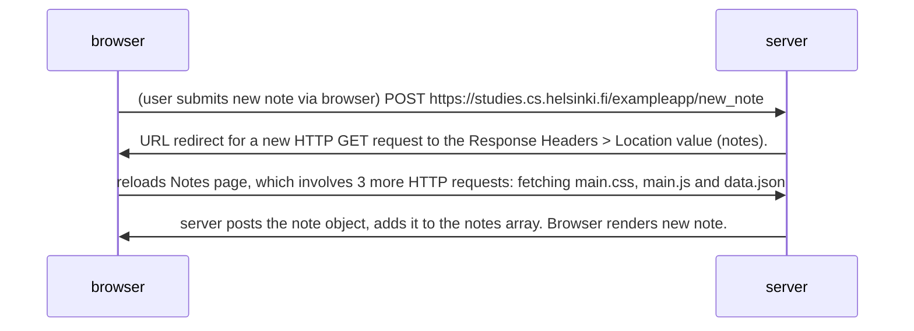

## New note diagram

```mermaid
sequenceDiagram
    participant browser
    participant server

    browser->>server: (user submits new note via browser) POST https://studies.cs.helsinki.fi/exampleapp/new_note
    server->>browser: URL redirect for a new HTTP GET request to the Response Headers > Location value (notes).
    browser->>server: reloads Notes page, which involves 3 more HTTP requests: fetching main.css, main.js and data.json
    server->>browser: server posts the note object, adds it to the notes array. Browser renders new note.

```
