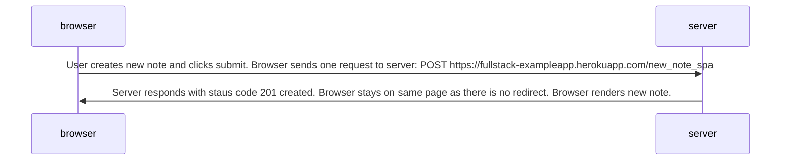

## Single page app diagram

```mermaid
sequenceDiagram
  participant browser
  participant server

  browser->>server: User creates new note and clicks submit. Browser sends one request to server: POST https://fullstack-exampleapp.herokuapp.com/new_note_spa
  server->>browser: Server responds with staus code 201 created. Browser stays on same page as there is no redirect. Browser renders new note.


```
